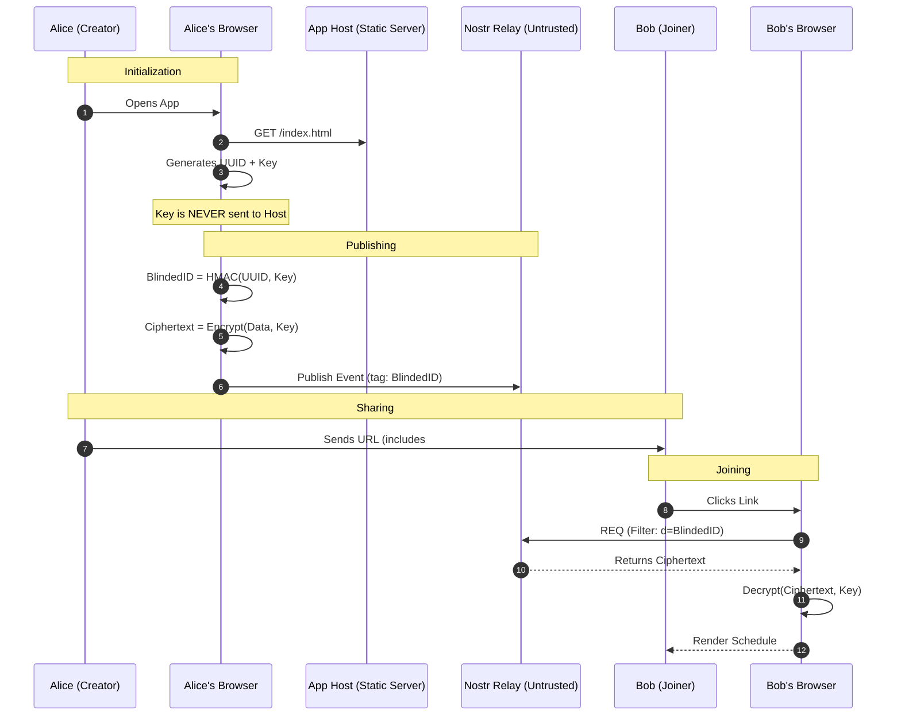
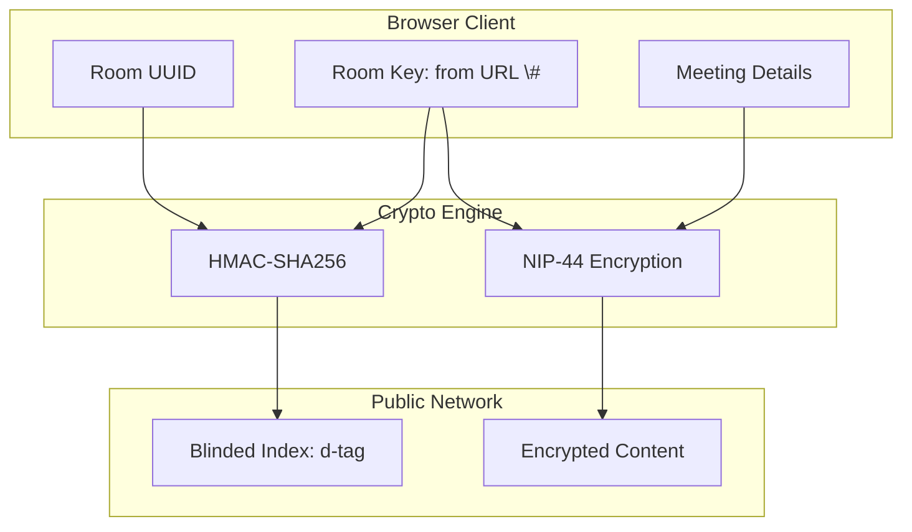

<!-- SPDX-License-Identifier: GPL-3.0-or-later -->
<!-- Copyright (C) 2025-present Masaya Taniguchi -->

# OpenSlots: A Trustless, Privacy-Preserving Scheduling Protocol over Nostr

<p align="center">
  
</p>

## Abstract

Centralized scheduling services provide usability at the cost of extensive metadata exposure, including social-graph inference (who meets whom), temporal patterns (when), and contextual cues (often why). This project presents **OpenSlots**, a zero-knowledge scheduling application implemented as a browser-based thick client atop the **Nostr** relay network. OpenSlots decouples application logic from storage by publishing encrypted, replaceable events to untrusted relays while distributing decryption capability exclusively via URL fragments. The design integrates (i) client-side key generation and end-to-end encryption using **NIP-44** (ChaCha20-Poly1305), (ii) *blinded indexing* via **HMAC-SHA256** to mitigate relay-side observability of room identifiers, and (iii) compact availability encoding via bitmask compression to respect relay payload constraints. This README documents the adversary model, analyzes confidentiality and metadata leakage, and discusses operational trade-offs and limitations. The resulting system provides a censorship-resistant and trust-minimized alternative to centralized platforms such as Doodle or Calendly.

**Keywords:** decentralized scheduling, Nostr, end-to-end encryption, metadata privacy, blinded indexing, zero-knowledge applications


## 1. Introduction

Scheduling across time zones remains a recurrent coordination bottleneck for distributed teams. Widely deployed solutions implement a server-centric architecture in which a provider stores meeting identifiers, availability responses, and participant identifiers. While the meeting content may appear benign, the associated metadata forms a high-value *inference surface*: access logs and database records enable reconstruction of organizational rhythms, cross-group interactions, and sensitivity of projects.

This project advances the thesis that scheduling can be modeled as a **protocol interaction** rather than a **hosted service**. In this framing, the network acts as a content-addressed or tag-indexed substrate, while confidentiality and integrity are enforced at the endpoints. **OpenSlots** operationalizes this thesis by using the Nostr relay ecosystem as an untrusted transport and persistence layer, with all cryptographic and application state maintained in the browser.

### 1.1 Problem Statement

We target the following design objectives:

1. **No trusted third party (TTP):** No server should be entrusted with plaintext meeting details, participant identities, or availability.
2. **Censorship resistance and availability:** Data should be retrievable even if individual storage providers are unavailable or censor content.
3. **Practical usability:** The system should be accessible from commodity browsers without specialized hardware or account provisioning.
4. **Relay-side minimization of linkability:** Even if relays observe event tags and query patterns, they should be prevented from trivially mapping those observations to human-meaningful room identifiers.

### 1.2 Contributions

This project makes three main contributions:

* **Architecture:** A thick-client scheduling application that uses Nostr relays solely for encrypted event storage and retrieval, enabling decentralized persistence.
* **Security construction:** A client-held symmetric room key distributed via URL fragments, used for both payload encryption (NIP-44) and blinded indexing (HMAC-SHA256).
* **Efficiency technique:** A bitmask compression scheme for availability that substantially reduces payload size under typical meeting-grid resolutions.


## 2. Background and Design Rationale

### 2.1 Nostr as a Relay Substrate

Nostr ("Notes and Other Stuff Transmitted by Relays") specifies a simple event model in which clients publish signed events to relays and fetch events via filters. Relays are not assumed to be trustworthy; rather, they implement minimal functionality (store, forward, filter). This architecture aligns with the OpenSlots requirement that storage providers be replaceable and non-authoritative.

### 2.2 Replaceable Events for Collaborative State

OpenSlots represents rooms and responses using **Kind 30030** events (parameterized replaceable events). Replaceability permits a room creator to update meeting parameters and participants to revise availability without generating unbounded event histories, which is beneficial under relay retention policies and client synchronization.


## 3. System Architecture

OpenSlots is implemented as a Single Page Application (SPA) adopting a **thick-client** paradigm. All protocol logic—key generation, encryption/decryption, availability encoding, and UI state transitions—executes in the browser runtime.

### 3.1 Implementation Stack

* **Frontend framework:** **Preact** provides a reduced bundle footprint relative to larger component frameworks, improving load performance under mobile network conditions.
* **UI layer:** **Bootstrap 5** provides responsive layout primitives for heterogeneous device sizes.
* **State management:** **Signals** (`@preact/signals`) enable fine-grained reactive updates, avoiding expensive re-renders when multiple participants update schedules concurrently.
* **Temporal correctness:** The **Temporal API** (via polyfill) is used to model time zones and DST transitions explicitly, reducing common scheduling errors arising from implicit Date semantics.

### 3.2 Data Model

We distinguish three logical layers:

1. **Room configuration:** meeting title/description (optional), grid resolution, date range, and time-zone context.
2. **Participant responses:** each participant’s availability mask and optional display label.
3. **Derived views:** aggregated availability (e.g., intersection counts per slot), rendered deterministically from encrypted room data.

Only encrypted representations of (1) and (2) are published to relays.

### 3.3 Relay Interaction

Clients publish and query events using a relay set (e.g., multiple WebSocket endpoints). The use of multiple relays provides redundancy against outages and selective censorship. Because relays are untrusted and potentially adversarial, the protocol minimizes what relays can learn from stored content and indexing tags.


## 4. Threat Model and Security Goals

### 4.1 Adversary Model

We assume a probabilistic polynomial-time (PPT) adversary with any subset of the following capabilities:

* **Relay operator adversary:** reads all published events and metadata (timestamps, tags), observes subscription filters, and selectively withholds events.
* **Network observer:** can observe client IP addresses and traffic timing (e.g., ISP-level adversary), but does not break TLS.
* **Malicious participant:** obtains the room URL (thus the room key) and attempts to deanonymize other participants or manipulate state.

We explicitly do **not** assume a trusted host, trusted relay, or secure enclave.

### 4.2 Security Goals

* **Confidentiality of meeting content:** Without the room key, an adversary cannot recover titles, time grids, or individual availabilities.
* **Integrity and authenticity (best-effort):** Participants can detect malformed ciphertexts; event signing and application-level validation reduce trivial tampering.
* **Minimized identifier leakage:** Relays should not learn stable, human-meaningful room identifiers; linkability should require possession of the room URL.

### 4.3 Non-goals and Residual Leakage

* **Traffic analysis resistance:** IP addresses and timing may reveal participation patterns.
* **Global anonymity:** OpenSlots does not provide network-layer anonymity; users requiring stronger protections should combine it with anonymity networks (e.g., Tor) or relay access via privacy-preserving proxies.


## 5. Cryptographic Design

### 5.1 Anchor of Trust: URL Fragments

OpenSlots distributes the room’s symmetric key using a URL fragment. Standard browser behavior does not transmit the fragment portion (after `#`) in HTTP requests, enabling key distribution without server disclosure.

* **URL form:** `https://openslots.pages.dev/room/<UUID>#<Key>`
* **Key:** 32-byte random value generated client-side

Under this construction, the static host learns only that the application was loaded; it does not learn the room key and cannot decrypt relay content.

### 5.2 Blinded Indexing via HMAC-SHA256

A direct use of the room UUID as an event tag would allow relays to enumerate active rooms and correlate repeated queries. To mitigate this, OpenSlots computes a blinded identifier:

$$
\mathtt{blinded_ID} = \mathrm{HMAC}_{\mathtt{Key}}(\mathtt{RoomUUID})
$$

Relays index and filter by `blinded_ID` rather than the UUID. Without the key, a relay cannot feasibly map `blinded_ID` back to the original UUID. This reduces *passive* observability of room identifiers, although it does not eliminate *active* correlation attacks if an adversary obtains the room URL.

### 5.3 Payload Encryption with NIP-44 (ChaCha20-Poly1305)

All sensitive content is encrypted using **NIP-44**, which specifies authenticated encryption (AEAD) based on ChaCha20-Poly1305. The room key serves as the symmetric key for encrypting the serialized room state.

Security is therefore reduced to the confidentiality and integrity properties of AEAD under a uniformly random key, assuming correct nonce management as required by the NIP-44 specification.

### 5.4 Key Separation Considerations

OpenSlots derives independent subkeys using HKDF to avoid coupling HMAC and encryption contexts:

$$
K_{\text{enc}}, K_{\text{hmac}} = \mathrm{HKDF}(K_{\text{room}}, \text{context})
$$

This explicit key separation aligns with cryptographic best practices and simplifies reasoning about security boundaries.


## 6. Efficient Encoding of Availability

### 6.1 Motivation

Relays may enforce payload-size limits or rate constraints; moreover, larger ciphertexts increase latency and client-side computation. Representing availability as a list of timestamps is inefficient: for a meeting horizon of $D$ days with $\Delta$-minute resolution, the number of slots scales as $O(D \cdot 24 \cdot 60 / \Delta)$.

### 6.2 Bitmask Construction

OpenSlots encodes availability as a bitmask over a fixed epoch:

1. Choose an epoch $t_0$ (start time of the first slot).
2. Define $n$ slots at resolution $\Delta$.
3. Construct a binary string $b \in \{0,1\}^n$ where $b_i = 1$ denotes "available" for slot $i$.

A compact JSON representation is then:

```json
{
  "start": 1700000000,
  "mask": "110011101..."
}
```

The storage benefit is substantial: a bitmask requires $n$ bits (plus encoding overhead), whereas timestamps require $O(n)$ integers. For typical schedules, this reduces payload size by an order of magnitude, improving both bandwidth consumption and cryptographic processing time.

### 6.3 Aggregation Semantics

Given $m$ participants with bitmasks $b^{(1)},\dots,b^{(m)}$, the per-slot availability count is:

$$
c_i = \sum_{j=1}^{m} b^{(j)}_i.
$$

Clients can compute $c_i$ locally after decryption, enabling privacy-preserving aggregation without revealing individual responses to relays.


## 7. Protocol Walkthrough

### 7.1 End-to-End Flow

The core sequence is as follows:

1. Creator loads the SPA and generates `RoomUUID` and `Key`.
2. Creator computes `blinded_ID` and encrypts the room payload.
3. Client publishes the encrypted event to one or more relays under tag `blinded_ID`.
4. Creator shares the room URL containing `#Key` out-of-band.
5. Joiner computes the same `blinded_ID`, queries relays, fetches ciphertext, and decrypts locally.

### 7.2 Diagrammatic Representation

The following sequence diagram illustrates the isolation of the key to the client and the relay’s view restricted to blinded tags and ciphertext.



A complementary view of key usage for indexing and secrecy is given below.




## 8. Discussion

### 8.1 Privacy Properties and Limitations

OpenSlots achieves content confidentiality against relays and passive observers lacking the key. However, several leakage channels remain:

* **Network identifiers:** Relays can associate queries with IP addresses.
* **Timing correlations:** Publication and retrieval times can reveal participation windows.
* **Relay set fingerprinting:** Unique relay selection may act as a quasi-identifier across sessions.

These limitations are intrinsic to many E2EE systems deployed over observable networks. Mitigations include routing relay traffic via anonymity networks and standardizing relay sets.

### 8.2 Censorship Resistance and Availability

Using multiple relays improves availability but introduces consistency concerns (stale replicas, partial propagation). Replaceable events mitigate uncontrolled growth, yet clients must implement sensible relay-selection and reconciliation strategies.

### 8.3 Usability–Security Trade-offs

The URL-fragment key distribution yields strong minimization of server knowledge, but security becomes contingent on link secrecy. Users must treat room URLs as bearer tokens. For high-stakes coordination, additional access control mechanisms (e.g., invite codes, participant public keys, or threshold sharing) may be warranted.


## 9. Conclusion

OpenSlots demonstrates that practical scheduling can be achieved without a trusted central service provider by treating scheduling as an encrypted protocol executed at the endpoints and persisted on untrusted relays. By combining client-side key generation, NIP-44 authenticated encryption, blinded indexing via HMAC, and efficient bitmask encoding, the system provides a trust-minimized and censorship-resistant alternative to conventional scheduling platforms.

Future work includes formal verification of key-derivation and nonce-handling logic, stronger access-control options beyond bearer-URL semantics, and systematic evaluation of metadata leakage under realistic network adversaries.


## Appendix A. Developer Considerations

While the core protocol is defined above, the following implementation details are critical for contributors and anyone forking this codebase:

* **Time Zone Serialization:** JavaScript's `Date` object is notoriously flaky with time zones. We rely strictly on the **Temporal API** (using a polyfill where necessary) to ensure that slot definitions remain stable across DST transitions.
* **JSON Readability vs. Size:** The bitmask encoding is designed for compactness. While Base64 encoding would save more space, we currently stick to a binary string in JSON for easier debugging during the alpha phase. Future versions may optimize this further.
* **Key Derivation Best Practices:** OpenSlots derives separate sub-keys for `encryption` and `indexing` using **HKDF** (HMAC-based Key Derivation Function), avoiding key reuse across contexts.


## Appendix B. Landscape and Alternatives

OpenSlots sits at the intersection of user-friendly scheduling and paranoid-level privacy. Here is how it compares to existing solutions and why a new protocol was necessary.

### 1. Traditional & Self-Hosted (Web 2.0 / 2.5)

Tools like **Doodle**, **Calendly**, or even self-hosted options like **Cal.com** and **Rallly** offer excellent UX but fundamentally different security models.

* **The Gap:** Even when self-hosting, the server administrator technically possesses the keys to the kingdom (plaintext database access). OpenSlots is designed for scenarios where *no* server administrator can be trusted, not even yourself.

### 2. The Nostr Ecosystem

Why not just use existing Nostr standards?

* **NIP-52 (Calendar Events):** This NIP is excellent for *public* events (concerts, webinars) or public availability. OpenSlots targets *private* coordination where the very existence of the meeting should be obfuscated from the public relay network.
* **NIP-17 & Gift Wrap:** While we could wrap invitations in NIP-59 (Gift Wraps) for privacy, OpenSlots focuses on the *state* of the schedule (the grid), which needs to be updated by multiple parties asynchronously without the overhead of direct messaging protocols.

### 3. Advanced Privacy Tech (ZKP & MPC)

There is significant academic work in **Private Set Intersection (PSI)** and **Secure Multi-Party Computation (SMPC)** to mathematically prove time-slot overlaps without revealing schedules.

* **The Trade-off:** These solutions often require heavy computation or constant online presence. OpenSlots chooses a pragmatic middle ground: "Thick Client" encryption. It offers 95% of the privacy benefits of SMPC with 100% of the usability of a standard web app.

### 4. Summary of Architecture

| Model | Storage | Privacy | Trust Anchor |
| --- | --- | --- | --- |
| **SaaS (Calendly)** | Central DB | Policy-based | The Company |
| **Self-Hosted (Cal.com)** | Your DB | Access Control | The Admin |
| **OpenSlots** | Public Relays | **End-to-End Encrypted** | **The URL / Client** |


## Appendix C. Code Quality Expectations

This project enforces strict code quality to keep cryptographic and scheduling logic reliable:

* **Test Coverage:** The suite targets 100% coverage across lines and functions. New changes should preserve that bar.
* **Static Checks:** Linting, type checking, and builds must pass (`bun run lint`, `bun run typecheck`, `bun run build`).
* **Test Suite:** Always run `bun test` to validate behavior and maintain deterministic outcomes.
